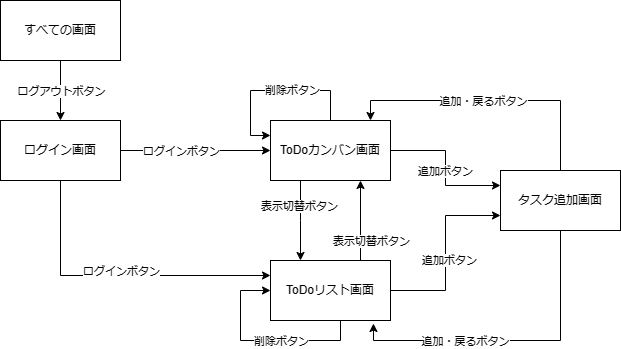

# 画面遷移図
 

# 詳細

## 表示形式
カンバンボード形式とリスト形式の状態保持はデータベースで行う。 

## データベース定義

### user_setting
|カラム名|型|初期値|NOT NULL|PRIMARY KEY|その他|
|-|-|-|-|-|-|
|id|INT ZEROFILL|-|〇|〇|AUTO INCREMENT|
|kanban_flg|CHAR(1)|N|〇|×|-|
